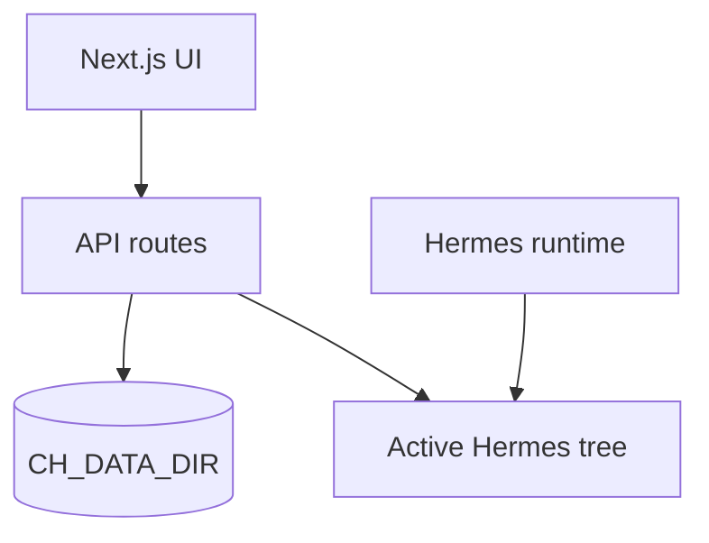

# Control Hub platform vision

This is the architecture story—not a roadmap slide deck. Control Hub is the **Next.js control plane** I ship for [Hermes Agent](https://github.com/NousResearch/hermes-agent): missions, cron, configuration, sessions, memory, and day-to-day operator workflows. Execution stays in **Hermes** (gateway, scheduler). This app edits Hermes and Control Hub state through audited REST routes.

## Architecture (layers)

- **`CH_DATA_DIR`** (default `~/control-hub/data`, overridable via `CH_DATA_DIR` / `CONTROL_HUB_DATA_DIR`): Control Hub state—missions, templates, stories, Rec Room data, SQLite (`control-hub.db`), hardware cron scripts/logs defaults (`CH_SCRIPTS_DIR`, `CH_HARDWARE_LOG_DIR` under this tree unless overridden).

- **Active Hermes install:** Paths for profiles, skills, sessions, logs, `config.yaml`, agent **`cron/jobs.json`**, and related files come from **`getActiveHermesPaths()`** / **`getActiveHermesHome()`** in `src/lib/hermes-agent-runtime.ts`, driven by **`HERMES_HOME`** / **`AGENT_HOME`** env vars (default `~/.hermes`).

- **Hardware cron** (OS-level scripts managed by Control Hub) is separate from Hermes agent cron: different directories and **`/api/cron/hardware`** vs Hermes **`jobs.json`** via **`/api/cron`**.

## Scheduling

- **Agent cron:** Jobs are rows in the active install’s **`cron/jobs.json`** (path from `getActiveHermesPaths().cronJobs`). Control Hub uses a file lock compatible with Hermes.

- Recurring jobs use **`repeat.times: null`** for infinite runs (Hermes canonical).

- **`parseSchedule`** accepts interval expressions, ISO one-shots, and five- or six-field cron strings; invalid input is rejected on user-facing routes.

## Core features

| Area | Role |
|------|------|
| Model / provider | SQLite DB + `/api/models`, `/api/credentials`, `/api/models/defaults`; UI at `/config/models`; write-through to Hermes `~/.hermes/.env` and `config.yaml`. |
| Missions | CRUD, dispatch, templates (built-in set). |
| Cron | CRUD against the active Hermes `jobs.json`; hardware cron under `CH_*` paths. |
| Config / sessions / memory / gateway / logs / skills / personalities | Hermes-aligned surfaces as shipped in this repo. |

This document describes the product surface shipped in this repository.

## Security

- Treat the UI and API as **same-trust**: run on a private network or behind your own access controls. Optional **`CH_REQUEST_SIGNING_SECRET`** can harden selected routes (see `src/lib/api-auth.ts`).

- Config writes use whitelisted sections; model and credential updates go through **`/api/models`** and **`/api/credentials`** (see [API.md](API.md)).

## Related docs

- [MIGRATION.md](MIGRATION.md) — data directory migration.

- [DEPLOY.md](DEPLOY.md) — host, port, TLS, Docker.

- [HERMES_CONFIG_INTEGRATION.md](HERMES_CONFIG_INTEGRATION.md) — optional `hermes-config` checklist.

- [CONTROL_HUB.md](CONTROL_HUB.md) — architecture overview and where to read next.
